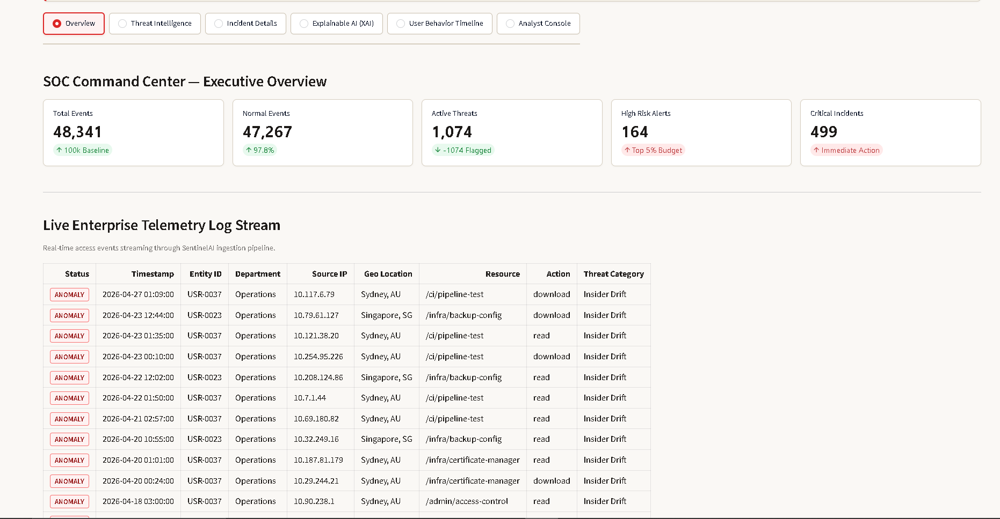
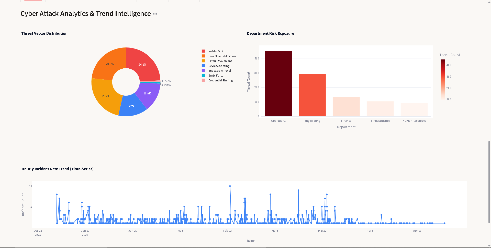
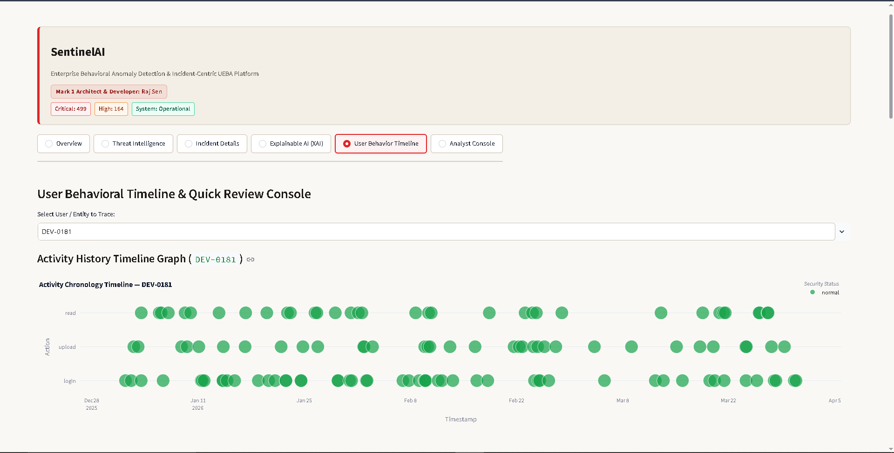
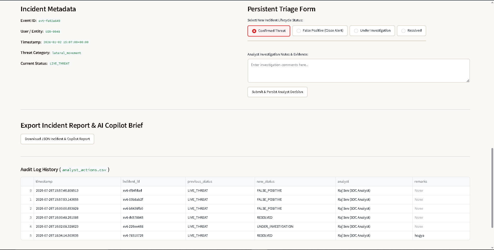
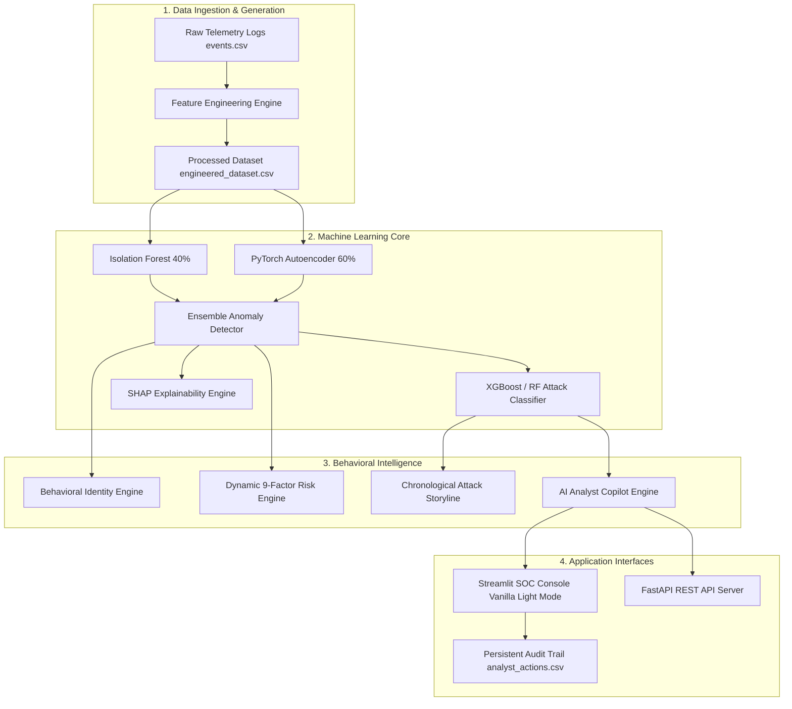

# SentinelAI — Enterprise UEBA & SOC Incident Intelligence Platform

<p align="center">
  
  
  
  
  
  
</p>

> **An Incident-Centric Behavioral Anomaly Detection, AI Analyst Copilot, and Dynamic Risk Intelligence Platform for Enterprise Security Operations Centers (SOC).**

---

## Table of Contents
1. [Executive Overview](#-executive-overview)
2. [Enterprise Dashboard Preview](#-enterprise-dashboard-preview)
3. [Core Technical Innovations & Engines](#-core-technical-innovations--engines)
4. [System Architecture](#-system-architecture)
5. [Enterprise SOC Dashboard Workspaces](#-enterprise-soc-dashboard-workspaces)
6. [Feature Engineering & Dataset Schema](#-feature-engineering--dataset-schema)
7. [Machine Learning Pipeline](#-machine-learning-pipeline)
8. [AI Analyst Copilot & Triage Briefs](#-ai-analyst-copilot--triage-briefs)
9. [Quick Start & Setup Guide](#-quick-start--setup-guide)
10. [FastAPI REST API Endpoints](#-fastapi-rest-api-endpoints)
11. [Docker & Container Deployment](#-docker--container-deployment)
12. [Feasibility, Viability & ROI](#-feasibility-viability--roi)
13. [Project Directory Structure](#-project-directory-structure)
14. [Licensing & Hackathon Credits](#-licensing--hackathon-credits)

---

## 📌 Executive Overview

Modern enterprise Security Operations Centers (SOCs) are overwhelmed by **alert fatigue**. Traditional SIEM systems generate thousands of isolated access log alerts daily, resulting in high false-positive rates, missed low-and-slow attacks, and analyst burnout.

**SentinelAI** fundamentally shifts SOC operations from **alert-centric log noise** to **incident-centric entity storytelling**:
- **Entity-Centric Aggregation**: Automatically groups sequential 24-hour telemetry access events by entity profile.
- **Double Ensemble Anomaly Detection**: Blends tree-based Isolation Forests with Deep PyTorch Autoencoder reconstruction loss.
- **Explainable AI (XAI)**: Calculates deterministic SHAP attributions so analysts understand *why* an event was flagged.
- **Autonomous AI Copilot**: Synthesizes 10-point investigation briefs with MITRE ATT&CK mappings and 1-click remediation scripts.
- **Persistent Compliance Audit Trail**: Syncs analyst triage decisions directly to dataset storage and maintains an immutable audit log (`analyst_actions.csv`).

---

## 🖼️ Enterprise Dashboard Preview

<div align="center">

| 📊 Streamlit SOC Analytics Dashboard | 🧠 Real-Time AI Decision & Safety Log |
| :---: | :---: |
|  |  |

| 👤 Behavioral Identity & Anomaly Profile | 📖 Chronological Attack Storyline Engine |
| :---: | :---: |
|  |  |

</div>

---

## ⚙️ Core Technical Innovations & Engines

### 1. 🌲 Double Ensemble Anomaly Detection Architecture
Combines statistical and deep neural network approaches into a unified anomaly score $S \in [0, 1]$:
$$\text{Score} = (0.4 \times S_{\text{IsolationForest}}) + (0.6 \times S_{\text{PyTorchAutoencoder}})$$
- **Isolation Forest**: Partitions feature space to catch sudden statistical outliers.
- **PyTorch Deep Bottleneck Autoencoder**: Measures feature reconstruction Mean Squared Error (MSE) to detect complex non-linear access anomalies.

### 2. 👤 Behavioral Identity Engine
Constructs dynamic historical baseline profiles for every user and entity profile across 6 key parameters:
1. **Typical Working Hours** (e.g., 08:00 – 18:00 UTC)
2. **Approved Corporate Devices** (Fingerprint hashes)
3. **Historical Geographic Locations** (Geo-lat/lon coordinates & velocity limits)
4. **Frequent Resource Categories** (Auth, HR, Finance, Code Repos, Admin Panels)
5. **Average Session Duration**
6. **Daily Access Frequency**

### 3. ⚡ Dynamic Multi-Factor Risk Engine
Evaluates real-time telemetry across **9 normalized risk factors** with a cumulative **24-hour velocity multiplier** (up to 1.5x):
- **Asset Sensitivity** (20%) • **Behavioral Deviation** (15%) • **Geo Velocity** (15%)
- **Device Novelty** (10%) • **Off-Hours Shift** (10%) • **Exfiltration Volume** (10%)
- **Privileged Command** (10%) • **VPN / Proxy Anonymizer** (5%) • **Repeated Anomaly** (5%)

### 4. 📖 Chronological Attack Storyline Engine
Reconstructs raw sequential access logs into a 5-stage chronological attack narrative:
1. *Initial Entry & Authentication*
2. *Device & Geo Anomaly*
3. *Privilege Escalation & Resource Access*
4. *Data Exfiltration Trace*
5. *Critical Containment & Action*

### 5. 🤖 Autonomous AI Analyst Copilot Assistant
Generates comprehensive 10-point incident briefs featuring MITRE ATT&CK TTP alignments, business impact assessments, **15–20 minutes in quantified time savings per investigation**, and copyable **PowerShell / AWS CLI containment scripts**.

### 6. 📜 Persistent Audit & Compliance Console
All analyst triage decisions (*Confirmed Threat*, *Under Investigation*, *False Positive*, *Resolved*) write persistently to `engineered_dataset.csv` and append to `analyst_actions.csv` for ISO 27001 / SOC 2 compliance.

---

## 🏗️ System Architecture



---

## 🖥️ Enterprise SOC Dashboard Workspaces

The Streamlit dashboard (`dashboard/app.py`) is styled using a high-contrast **Vanilla Light Mode palette (`#faf8f5`)** to prevent eye strain and ensure maximum legibility during active SOC triage:

1. **Overview & Command Center**: Top-level SOC metrics, critical anomaly counts, risk breakdowns, and integrated live telemetry access stream.
2. **Threat Intelligence**: Interactive matrix filtering incidents by Attack Type (*Brute Force*, *Impossible Travel*, *Credential Stuffing*, *Lateral Movement*, *Low-and-Slow Exfiltration*), Department, and Entity ID.
3. **Incident Details Workspace**: 2-column SOC workbench featuring real-time persistent triage buttons (*Confirm Threat*, *Under Investigation*, *False Positive*, *Mark Resolved*) synced directly to dataset storage.
4. **Explainable AI (XAI)**: Detailed SHAP feature attributions, behavioral baseline deviations, and 9-factor risk scoring scorecards.
5. **User Behavior Timeline**: Chronological Plotly activity scatter plot, telemetry history table, and step-by-step incident attack storylines.
6. **Analyst Console**: Autonomous AI Copilot briefs, time-savings metrics, copyable remediation scripts, and auditor action logs.

---

## 📊 Feature Engineering & Dataset Schema

### Engineered Feature Categories (`engineered_dataset.csv`)

| Feature Group | Features | Description |
| :--- | :--- | :--- |
| **Temporal** | `hour_of_day`, `day_of_week`, `is_weekend`, `is_off_hours` | Access time window flags relative to entity working hours |
| **Velocity & Distance** | `geo_velocity_kmh`, `geo_distance_km` | Travel speed between consecutive logins (impossible travel >500 km/h) |
| **Novelty Flags** | `geo_novelty`, `device_novelty`, `resource_novelty` | Unseen location, device fingerprint, or target endpoint flags |
| **Z-Scores** | `hour_zscore`, `session_duration_zscore`, `bytes_zscore` | Statistical deviations from entity historical mean |
| **Rolling Windows** | `failed_auth_count_1h`, `unique_resources_24h`, `bytes_total_24h` | Aggregated rolling temporal metrics (1h, 24h, 7d) |
| **Compound Risk** | `risk_multiplier`, `bytes_per_second`, `auth_method_change` | Combined risk indicators and protocol shifts |

---

## 🤖 AI Analyst Copilot & Triage Briefs

For every flagged incident, the AI Copilot synthesizes a 10-point investigation brief:

```markdown
1. Target Entity & Department Identification
2. Executive Summary for SOC Leads
3. Detailed "Why Detected" Behavioral Explanation
4. Supporting Evidence Chain (IP, Device Hash, Location, Volume)
5. MITRE ATT&CK Tactic & Technique Alignment (e.g. T1078.004)
6. Business Impact Assessment (GDPR / ISO 27001 Exposure)
7. 4-Step Actionable Containment Protocol
8. Executable PowerShell & AWS CLI Remediation Script
9. Quantified Time Savings (15–20 minutes per investigation)
10. Copilot Confidence Percentage Score (e.g. 96.0%)
```

---

## 🚀 Quick Start & Setup Guide

### 1. Prerequisites & Virtual Environment

```bash
# Clone the repository
git clone https://github.com/rajsenyadav/SentinelAI.git
cd SentinelAI

# Create virtual environment
python -m venv venv
source venv/bin/activate  # Linux/macOS
# On Windows: venv\Scripts\activate

# Install dependencies
pip install -r requirements.txt
```

### 2. Generate Synthetic Dataset & Train ML Models

```bash
# Step 1: Generate synthetic telemetry logs
python scripts/generate_data.py

# Step 2: Run feature engineering pipeline
python scripts/run_feature_engineering.py

# Step 3: Train Double Ensemble Anomaly Detector
python scripts/train_anomaly_detector.py

# Step 4: Train Multi-Class Attack Classifier
python scripts/train_attack_classifier.py
```

### 3. Launch Enterprise Streamlit SOC Dashboard

```bash
python scripts/run_dashboard.py
# Or launch directly:
streamlit run dashboard/app.py
```
> Access Dashboard in Browser: **`http://localhost:8501`**

### 4. Launch FastAPI REST Backend

```bash
python scripts/run_backend.py
# Or launch directly:
uvicorn backend.app:app --host 0.0.0.0 --port 8000 --reload
```
> Interactive Swagger Documentation: **`http://localhost:8000/docs`**  
> ReDoc API Specification: **`http://localhost:8000/redoc`**

---

## 🌐 FastAPI REST API Endpoints

| Method | Endpoint | Description |
| :---: | :--- | :--- |
| `GET` | `/` | API service health check |
| `POST` | `/api/v1/predict` | End-to-end telemetry evaluation (`Feature Eng` -> `Detector` -> `Classifier` -> `Risk` -> `XAI`) |
| `POST` | `/api/v1/copilot/investigate` | Generate 10-point AI Copilot brief for specified event |
| `GET` | `/api/v1/alerts` | Fetch active high-risk incidents |
| `GET` | `/api/v1/dashboard` | Retrieve high-level SOC statistics & metrics |
| `POST` | `/api/v1/feedback` | Submit analyst persistent triage feedback |

---

## 🐳 Docker & Container Deployment

### Run via Docker Compose

```bash
docker-compose up --build -d
```
This spins up:
- **Streamlit Dashboard**: `http://localhost:8501`
- **FastAPI REST Server**: `http://localhost:8000`

---

## 📈 Feasibility, Viability & ROI

- **Alert Noise Reduction**: Reduces daily raw alert volume by up to **80%** by consolidating events into entity storylines.
- **Quantified Time Savings**: Saves **15–20 minutes per incident investigation**, enabling SOC teams to handle 4x incident load without increasing headcount.
- **Fast Inference**: Processes access log events in `<50ms` per record.
- **Regulatory Compliance**: Immutable audit trail (`analyst_actions.csv`) meets ISO 27001, SOC 2, and GDPR standards.

---

## 📂 Project Directory Structure

```
SentinelAI/
├── config/
│   └── data_config.yaml          # Dataset simulation parameters
├── data_generator/               # Synthetic telemetry & attack vector generator
├── feature_engine/               # Temporal, velocity, novelty & rolling feature pipeline
├── detection/
│   ├── isolation_forest.py       # Isolation Forest anomaly model
│   ├── autoencoder.py            # Deep PyTorch Autoencoder model
│   ├── detector.py               # Ensemble anomaly orchestrator
│   ├── behavioral_identity.py    # 6-parameter entity baseline profile engine
│   ├── dynamic_risk_engine.py    # Normalized 9-factor risk engine
│   ├── incident_storyline.py     # Chronological attack sequence linker
│   └── ai_analyst_copilot.py     # Autonomous SOC Tier-1/Tier-2 triage assistant
├── classifier/                   # Attack multi-class classifier (XGBoost / RF)
├── explainer/                    # SHAP feature attribution & XAI engine
├── dashboard/
│   ├── app.py                    # Main Streamlit SOC Dashboard Entry Point
│   ├── styles.css                # Vanilla Light Mode CSS Theme
│   ├── utils.py                  # Dataset single source of truth loader
│   └── components/               # Overview, Intel, Details, XAI, Timeline, Console, Cards
├── backend/
│   ├── app.py                    # FastAPI REST API Application Entry Point
│   ├── services/                 # Persistence & incident services
│   └── api/                      # REST endpoints (predict, copilot, alerts, feedback)
├── scripts/                      # CLI launchers for pipeline, ML training & servers
├── models/                       # Serialized model binaries (.pkl)
├── data/
│   ├── raw/                      # Generated raw telemetry CSVs
│   └── processed/                # Engineered ML dataset & audit logs
├── docs/                         # Architecture specs & master documentation
│   └── SENTINELAI_MASTER_DOCUMENTATION.md
├── Dockerfile                    # Single container configuration
├── docker-compose.yml            # Multi-container orchestration
├── requirements.txt              # Production dependency requirements
├── LICENSE                       # MIT Open Source License
└── README.md                     # Main project README
```

---

## 📜 Licensing & Hackathon Credits

* **Project**: Honeywell Campus Connect Hackathon Finalist Project
* **Lead System Architect & Developer**: **Raj Sen (Mark 1 Systems Architect)**
* **License**: [MIT License](LICENSE)
